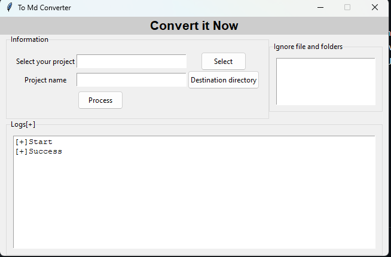

# Project to Markdown

## Features
- Combine multiple Python files into a single markdown document.
- Preserve Python code formatting and structure.
- Easy to use with a simple command-line interface.

## Installation
1. Clone the repository:
2. Navigate to the project directory:
    ```bash
    cd ProjectToMarkdown
    ```
3. Install dependencies:
    ```bash
    pip install -r requirements.txt

## Usage
Run the tool with the following command:
```bash
python ui.py 
```

## Contributing
Contributions are welcome! Please follow these steps:
1. Fork the repository.
2. Create a new branch:
    ```bash
    git checkout -b feature-name
    ```
3. Commit your changes:
    ```bash
    git commit -m "Add feature-name"
    ```
4. Push to your branch:
    ```bash
    git push origin feature-name
    ```
5. Open a pull request.

## License
This project is licensed under the MIT License. See the [LICENSE](LICENSE) file for details.
